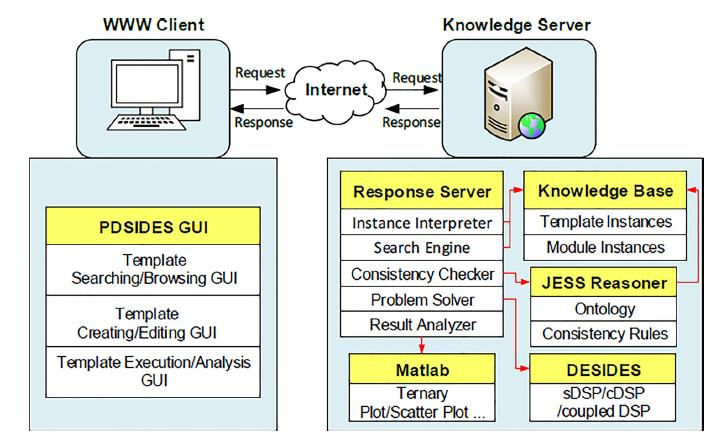
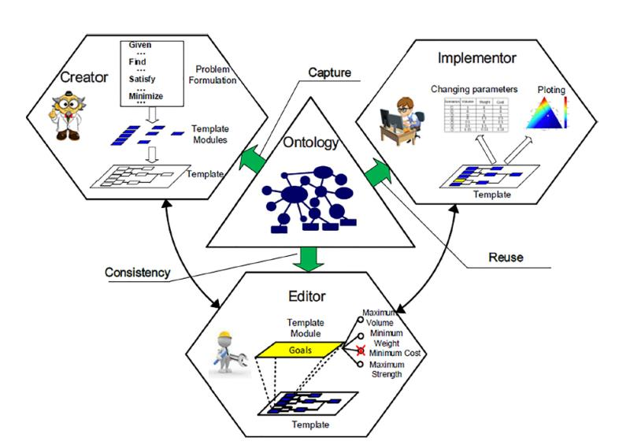
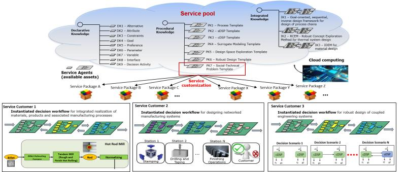

Using [this link](https://www.google.com) to access our CBDS platform

# An brief introduction of CBDS

The earlier version of CBDS is PDSIDES  - a “Knowledge-Based” Platform for Decision Support in the Design of Engineering Systems (PDSIDES). PDSIDES is anchored in modeling decision-related knowledge with templates using ontologies to facilitate execution and reuse. The two primary constructs required for the realization of decisions within PDSIDES are: 1) Decision Support Problem (DSP) construct and 2) Ontology. Three types of platform users are defined according to the amount of knowledge they have for operating the decision template, namely, Template Creators, Template Editors and Template Implementers. Template Creators are domain experts, and responsible for creating decision templates for original design, which requires the greatest novelty. Template Editors are senior designers who have sufficient knowledge and experience in a specific domain and are responsible for editing (or tailoring) existing decision templates in adaptive design, this requires the original templates to be adapted for new applications. Template Implementers are designers who have basic knowledge and typically little knowledge or interest in the analysis embodied in the template, they are responsible for executing existing decision templates that result in variant designs that require only parametric changes in the original decision templates. 

Now we are upgrading PDSIDES from a local server-based architecture to a cloud-based service-oriented architecture, which is the version that is under development, called CBDS (Cloud-Based Decision Support). In CBDS, all the templates will be modeled as services and deployed in a service pool on the cloud. Users (students/researchers/scholars) can customize the services for decision support in the design of different systems. The overview of CBDS is depicted in the picture below.

# The whole  framework of CBDS

